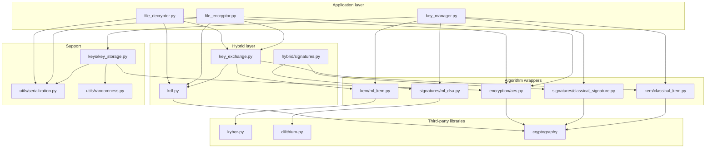
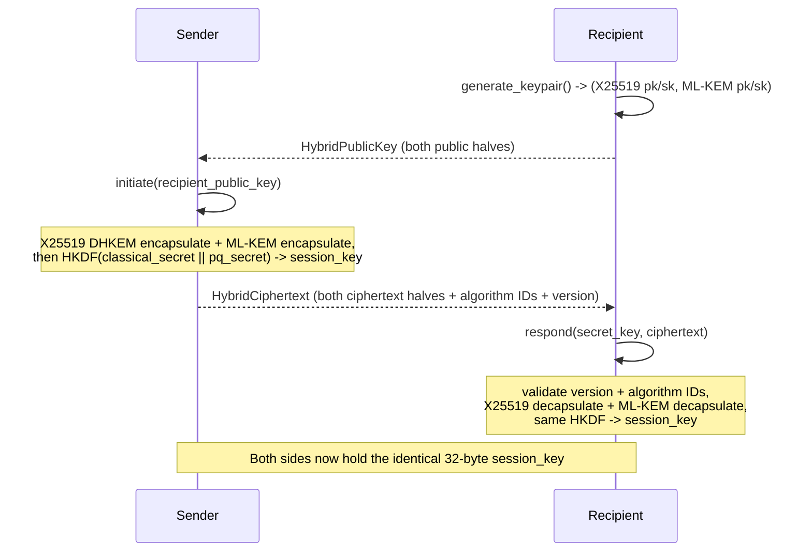
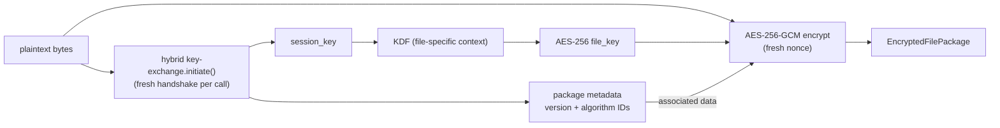
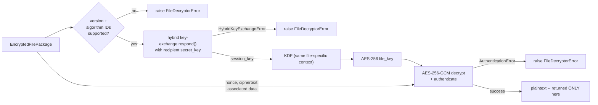
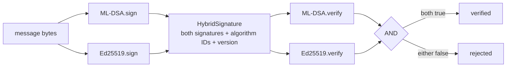
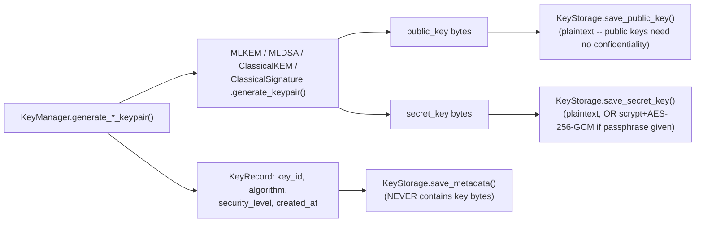

# Architecture

## 1. System overview

`pqcrypto` is organized in five layers. Each layer depends only on the
layer(s) below it — there are no upward or sideways dependencies back into
`hybrid/` from `kem/`, for instance, and no module outside `kem/`/`signatures/`
talks to a third-party cryptographic library directly.



## 2. Component responsibilities

| Module | Responsibility |
|---|---|
| `kem/ml_kem.py` | Thin wrapper around `kyber-py`; the ONLY place ML-KEM's third-party API is touched. |
| `kem/classical_kem.py` | X25519 wrapped in the same `generate_keypair`/`encapsulate`/`decapsulate` shape as `MLKEM`, via a DHKEM construction. |
| `signatures/ml_dsa.py` | Thin wrapper around `dilithium-py`; the ONLY place ML-DSA's third-party API is touched. |
| `signatures/classical_signature.py` | Ed25519, matching `MLDSA`'s method shape. |
| `hybrid/kdf.py` | HKDF-SHA256 combiner: turns one or more independently-established secrets into uniformly-random output key bytes, with mandatory domain separation. |
| `hybrid/key_exchange.py` | Combines `ClassicalKEM` + `MLKEM` via `kdf.py` into one session key; defines `HybridPublicKey`/`HybridSecretKey`/`HybridCiphertext`. |
| `hybrid/signatures.py` | Combines `MLDSA` + `ClassicalSignature`; verification policy is AND (both must verify). |
| `encryption/aes.py` | AES-256-GCM only. The sole place plaintext bytes are actually encrypted. |
| `encryption/file_encryptor.py` / `file_decryptor.py` | Wires hybrid key establishment → KDF → AES-GCM into one file-level operation, and its exact inverse. |
| `keys/key_storage.py` | Filesystem persistence: public/secret/metadata kept in separate subdirectories; optional passphrase-based encryption at rest. |
| `keys/key_manager.py` | Key lifecycle on top of `key_storage.py`: IDs, metadata, generation, rotation, deletion — never exposes key bytes through a metadata call. |
| `utils/serialization.py` | JSON envelope helpers: base64 for binary fields, required-field validation, deterministic encoding. |
| `utils/randomness.py` | `secrets`-backed random bytes for the project's OWN supporting code (salts, key IDs) — never used to seed ML-KEM/ML-DSA, which manage their own randomness per their FIPS specs. |

## 3. Dependency boundaries

```text
src/pqcrypto/encryption/file_encryptor.py, file_decryptor.py
        depends on: hybrid/key_exchange.py, hybrid/kdf.py, encryption/aes.py, utils/serialization.py
        MUST NOT depend on: kyber_py / dilithium_py / cryptography directly

src/pqcrypto/hybrid/*.py
        depends on: kem/*.py, signatures/*.py, (kdf.py depends on `cryptography`'s HKDF only)
        MUST NOT depend on: kyber_py / dilithium_py directly

src/pqcrypto/kem/ml_kem.py            <-> kyber_py         (isolated here only)
src/pqcrypto/signatures/ml_dsa.py     <-> dilithium_py      (isolated here only)
src/pqcrypto/kem/classical_kem.py,
src/pqcrypto/signatures/classical_signature.py,
src/pqcrypto/encryption/aes.py,
src/pqcrypto/hybrid/kdf.py            <-> cryptography (pyca)   (isolated to these files)
```

If `kyber-py` or `dilithium-py`'s API changes shape, only `ml_kem.py` /
`ml_dsa.py` need to change — every other module in the project depends on
`MLKEM/MLDSA`'s stable method signatures, never on the backend's own names.

## 4. Why the layers are separated the way they are

**Why ML-KEM is separated from AES.** ML-KEM is a KEM: it produces a
32-byte shared secret, not general-purpose ciphertext for arbitrary-length
plaintext. Using it to "encrypt" a file directly would be both wrong (it has
no such operation) and, even approximated, catastrophically inefficient —
lattice-based ciphertexts are hundreds to thousands of bytes to carry 32
bytes of payload. The standard, correct pattern — used here and in every
serious protocol (TLS 1.3's PQC hybrid modes included) — is: asymmetric
primitive establishes a *key*, symmetric primitive (AES-256-GCM) encrypts
the *data*.

**Why ML-DSA is separated from encryption.** Signing and encrypting solve
different problems (authenticity vs. confidentiality) and have independent
failure modes; keeping `hybrid/signatures.py` and `encryption/file_*.py` as
separate call sites means a caller must explicitly choose to add a signature
layer rather than getting one bundled invisibly into "encryption," and means
either can be tested, benchmarked, and reasoned about independently.

**Why the KDF is its own module.** `hybrid/kdf.py` is imported by BOTH
`hybrid/key_exchange.py` (deriving the hybrid session key) and
`encryption/file_encryptor.py`/`file_decryptor.py` (deriving the
file-specific AES key from that session key, with a *different*
domain-separation context — see `FILE_ENCRYPTION_KDF_CONTEXT` vs.
`HYBRID_KEX_CONTEXT`). Centralizing the HKDF call means every derivation in
the project goes through the same reviewed construction and the same
input-length validation, instead of each call site re-implementing "hash
some secrets together."

**Why third-party crypto APIs are isolated behind wrappers.** `kyber-py`
and `dilithium-py` are pre-1.0, educational implementations that ship one
object per parameter set with their own (non-standardized-across-libraries)
method names. Wrapping them behind `MLKEM`/`MLDSA` means: (1) the rest of
the project has one stable interface to depend on regardless of backend
churn, (2) input validation and error types are consistent everywhere, and
(3) swapping to a different backend (e.g. a future `liboqs`-based
implementation) touches exactly one file per algorithm.

**Why encrypted files carry explicit algorithm/version metadata.**
`EncryptedFilePackage` includes `version`, `kdf_algorithm`, `aead_algorithm`,
`classical_algorithm`, and `ml_kem_security_level` as plain (non-secret)
fields, and binds them into the AES-GCM associated data so they can't be
swapped undetected. This is what makes **algorithm agility** possible: a
future version of this project can add a new AEAD or PQC parameter set and
still correctly reject (rather than silently mis-decrypt) a package produced
under a different, unsupported combination — see
`file_decryptor.py`'s version/algorithm checks, which run *before* any key
recovery is attempted.

## 5. Data flow diagrams

### 5.1 Hybrid key-exchange flow



### 5.2 File encryption flow



### 5.3 File decryption flow



### 5.4 Signing flow



### 5.5 Key-management flow



### 5.6 Serialization flow

`utils/serialization.py` provides one canonical envelope used by both
`keys/key_storage.py` (key metadata) and `encryption/file_encryptor.py`
(`EncryptedFilePackage`): a JSON object with sorted, deterministic key
ordering, binary fields base64-encoded, and caller-declared `required_fields`
checked on load. Neither module invents its own binary layout.

### 5.7 Benchmark flow

Each `benchmarks/benchmark_*.py` script imports the project's own wrapper
classes (never the third-party library directly), runs warm-up iterations,
then timed iterations via the shared `benchmarks/_bench_common.py` helper,
and writes both a console table and a JSON file under
`data/benchmark_results/`. See [`benchmarking.md`](benchmarking.md) for full
methodology.

## 6. Trust boundaries

```text
                    ┌─────────────────────────────┐
                    │  Untrusted / adversarial     │
                    │  (network, disk, other party)│
                    └──────────────┬───────────────┘
                                   │
      EncryptedFilePackage bytes, HybridCiphertext bytes,
      HybridSignature bytes, public keys -- ALL treated as
      attacker-controlled until validated
                                   │
                                   ▼
      ┌────────────────────────────────────────────────────┐
      │  pqcrypto validation boundary                        │
      │  - type checks (TypeError for wrong Python type)      │
      │  - length checks against the declared algorithm       │
      │  - version/algorithm-identifier checks                │
      │  - AEAD authentication (AES-GCM tag verification)     │
      │  - signature verification (ML-DSA AND classical)      │
      └──────────────────────┬───────────────────────────────┘
                              │  only data that passed EVERY check
                              ▼
                    ┌─────────────────────────────┐
                    │  Trusted: plaintext returned  │
                    │  to the caller                │
                    └─────────────────────────────┘
```

Private/secret key material (`HybridSecretKey`, raw ML-KEM/ML-DSA/X25519/
Ed25519 secret keys) is trusted local state, supplied by the caller — this
project never receives secret keys over an untrusted channel and never
transmits them. The one place secret key bytes touch disk
(`keys/key_storage.py`) is documented as plaintext-by-default with an
explicit opt-in passphrase-encryption path; see that module's docstring and
[`security_analysis.md`](security_analysis.md) for the full caveat.
